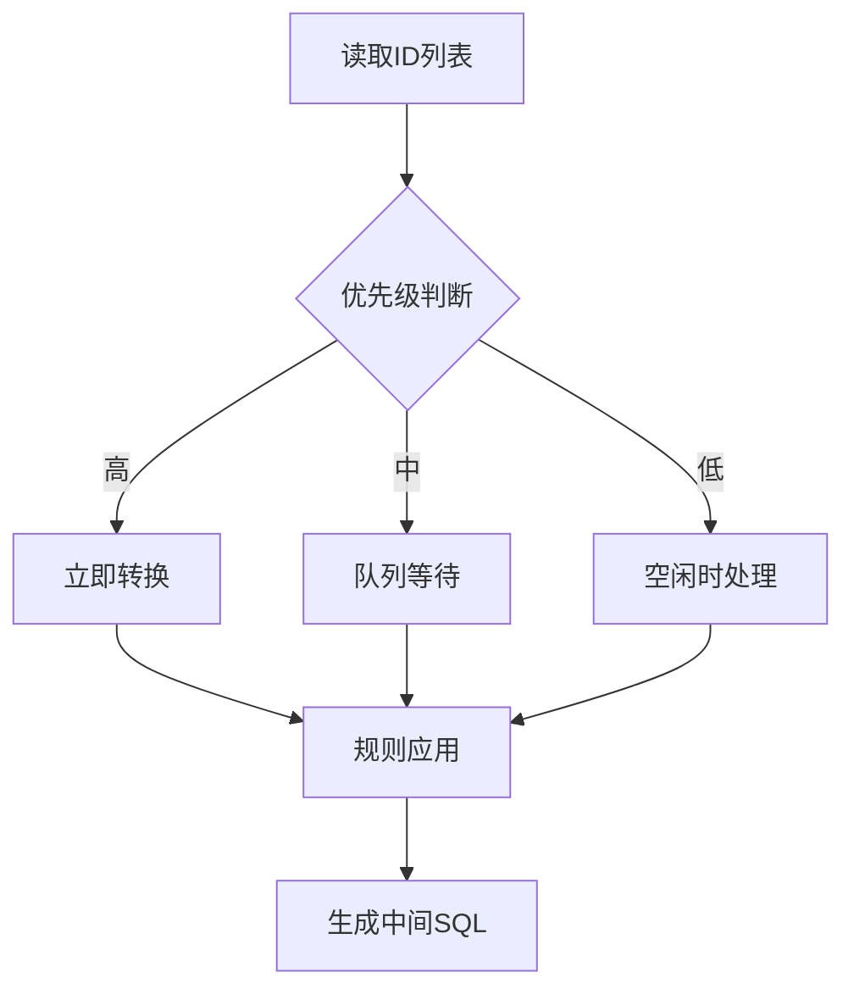
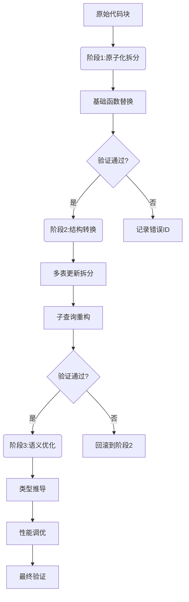
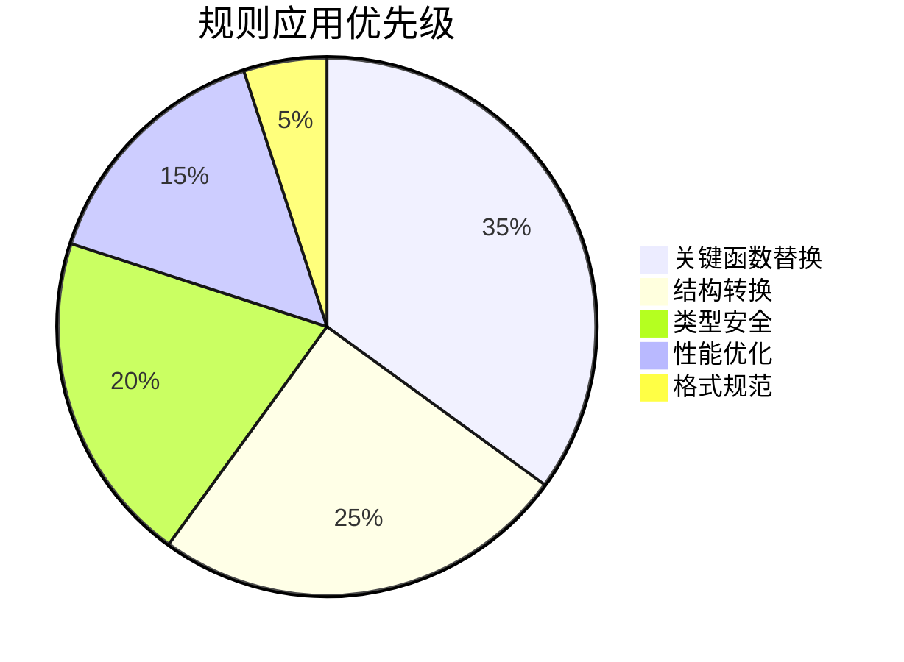

# convert_mysql_to_higigo
仓库中是xml文件，需要转换为higigo的sql文件

## 流程
```mermaid
graph TD
[输入XML] --> B[解析器]
B --> C{需要转换?}
C -->|是| D[生成ID列表]
C -->|否| E[跳过]
D --> F[优先级排序]
F --> G[转换引擎]
G --> H[验证模块]
H --> I{通过?}
I -->|是| J[生成SQL]
I -->|否| K[二次转换]
```

## 转换规则 
rule.md

## 验证规则
valid_convert.md

## 规则预检清单

### 一、函数转换检查
1. **核心函数替换**
   - [ ] UUID() → uuid_generate_v4() || ''
   - [ ] IFNULL → COALESCE
   - [ ] GROUP_CONCAT → string_agg (需补充分隔符参数)
   - [ ] DATE_FORMAT → to_char (格式符映射检查)
   - [ ] STR_TO_DATE → to_timestamp
   - [ ] TIMESTAMPDIFF → EXTRACT + 时间单位转换

2. **时间函数处理**
   - [ ] 检查 DATE_ADD 参数结构转换
   - [ ] 验证 FROM_UNIXTIME 的毫秒处理(/1000)
   - [ ] 确保 DATE_SUB 的负号转换正确

3. **类型转换**
   - [ ] SIGNED → INTEGER
   - [ ] 状态值数字转字符串(status=1 → status='1')
   - [ ] 禁止添加未指定的显式类型转换

### 二、结构转换检查
1. **多表更新处理**
   - [ ] 拆分多表更新为独立UPDATE语句
   - [ ] 验证子查询包含原连接条件
   - [ ] 检查事务包裹标记

2. **子查询规范**
   - [ ] HAVING 条件移至 WHERE
   - [ ] 嵌套 IF 转换为 CASE WHEN
   - [ ] 验证别名作用域(禁止添加不存在别名)

3. **特殊语句处理**
   - [ ] REPLACE INTO → DELETE + INSERT 或 ON CONFLICT
   - [ ] ON DUPLICATE KEY → ON CONFLICT
   - [ ] BETWEEN 字符串转 IN 列表

### 三、语法规范检查
1. **基础语法**
   - [ ] 移除反引号 `` `column` → column ``
   - [ ] 为别名添加显式 AS (特别是 location)
   - [ ] 检查 BETWEEN 参数类型(字符串转 IN)

2. **转义符处理**
   - [ ] 保留 XML 转义符(&lt;, &gt;, &amp;)
   - [ ] 验证 CDATA 块内外转义符一致性

3. **聚合处理**
   - [ ] 自动补全 GROUP BY 缺失列
   - [ ] 移除冗余 DISTINCT
   - [ ] 添加 COUNT(DISTINCT) 防除零 CASE

### 四、验证机制检查
1. **分层验证流程**
   - [ ] 基础函数替换验证
   - [ ] AST 结构差异度评分
   - [ ] 类型兼容性检查
   - [ ] 执行计划分析

2. **异常处理**
   - [ ] 连续失败 3 次进入 exception_ids.txt
   - [ ] 生成每日质量报告(含 TOP 问题统计)

3. **测试用例覆盖**
   - [ ] 正向测试(函数替换正确性)
   - [ ] 负向测试(缺失 GROUP BY 处理)
   - [ ] 边缘案例(位置编号 GROUP BY)

### 五、注意事项
1. **代码结构保留**
   - [ ] 保持原有缩进/换行格式
   - [ ] 不优化代码风格

2. **转换原则**
   - [ ] 最小改动原则
   - [ ] 仅转换明确指定的规则
   - [ ] 未匹配模式记录告警日志

3. **人工复核标记**
   - [ ] 复杂 CASE WHEN 表达式标记 NEED_REVIEW
   - [ ] 未识别函数添加 TODO 注释
   - [ ] 类型转换冲突添加 WARNING 标记

## 文件结构规范A

├── input/ # 原始XML文件
│ └── example.xml
├── output/ # 转换结果
│ ├── sql/ # 最终可执行SQL
│ │ └── example.sql
│ └── intermediate/ # 中间文件
│ └── example_ids.txt
├── logs/ # 转换日志
│ └── example_log/
│ ├── id_123_log.md # 单个ID转换日志
│ └── validation_report.md
├── rule.md # 规则文档
└── valid_convert.md # 验证规则文档


## 转换流程详解

### 1. XML解析阶段


生成文件示例：
text:output/intermediate/example_ids.txt
优先级排序：H(高)-M(中)-L(低)
[H] id_123 [行数:45]
[H] id_456 [行数:32]
[M] id_789 [行数:75]


### 2. 转换执行阶段


日志文件示例：
markdown:logs/example_log/id_123_log.md
转换日志 - id_123
转换时间: 2023-12-20 14:30
验证结果
[x] 函数替换验证
[x] 语句结构验证
[ ] 值转换验证 (失败)
错误详情
```sql
-- 原始语句
DATE_FORMAT(create_time, '%Y-%m-%d %T')

-- 转换结果
DATE_FORMAT(create_time, 'YYYY-MM-DD HH24:MI:SS') -- 验证失败：函数未转换
```
根据验证结果，对转换后的内容二次转换，二次验证。
二次验证结果同样记录，并标记依然不通过的需要人工复核的代码块和定位错误原因。

对于验证通过的代码块，在对应的id_sql.txt中生成可以测试执行的sql语句，替换必要的变量，删除xml标签。

### 3. 结果生成阶段
最终文件规范：
将转换后的每个代码快替换到xml文件中，生成新的xml文件。在需要复核的代码块中，添加复核标记NEED_REVIEW，方便人工复核。


## 关键注意事项
1. **文件命名规范**：
   - ID列表文件：`[原文件名]_ids.txt`
   - 日志目录：`[原文件名]_log/`
   - 最终SQL：`[原文件名]_converted.sql`

2. **处理顺序保证**：
   ```mermaid
   flowchart LR
       A[高优先级] --> B[队列头部]
       C[中优先级] --> D[队列中部]
       E[低优先级] --> F[队列尾部]
   ```

3. **异常处理机制**：
   - 连续3次验证失败的ID自动进入`exception_ids.txt`
   - 每日生成转换质量报告：
     ```text:logs/daily_report.md
     ## 转换日报 - 2023-12-20
     **成功率**: 92.4%
     **Top问题**:
     1. 日期函数时区缺失 (23次)
     2. 嵌套IF未完全转换 (15次)
     3. GROUP BY自动补全错误 (7次)
     ```

## 复杂代码块处理方案，尤其是行数超出72行优先级低的代码块

### 分层处理架构


### 阶段划分与规则映射
| 处理阶段 | 专注规则类型                  | 检查工具                  | 容错机制                  |
|---------|------------------------------|-------------------------|-------------------------|
| 词法层  | 函数替换、转义符处理          | regex_checker.sh        | 未匹配模式记录到.log     |
| 语法层  | 结构转换、GROUP BY补全        | sqlparse_validator.py   | AST差异度<5%时自动修复   |
| 语义层  | 类型兼容、别名作用域          | pg_analyzer             | 生成修复建议报告         |
| 优化层  | 执行计划、索引建议            | explain_optimizer       | 标记为OPTIMIZE_TODO      |

### 分块处理策略
1. **代码分片机制**
```bash
# 将复杂SQL拆分为可独立处理的片段
python splitter.py input.sql -o fragments/
```
输出结构：
```
fragments/
├── func_替换清单.md
├── subquery_1.sql
├── join_condition.sql
└── main_structure.sql
```

2. **规则优先级矩阵**


3. **注意力维持机制**
```python
# validation_checkpoint.py
class Checkpoint:
    def __init__(self, rules):
        self.rule_groups = [
            {'name': '核心函数', 'rules': ['UUID', 'IFNULL']},
            {'name': '时间处理', 'rules': ['DATE_FORMAT','TIMESTAMPDIFF']},
            {'name': '结构转换', 'rules': ['多表更新','子查询']}
        ]
    
    def add_marker(self, sql):
        for group in self.rule_groups:
            markers = [f"/* CHECK_{rule} */" for rule in group['rules']]
            sql = re.sub(r'(\b'+'|'.join(group['rules'])+r'\b)', 
                        lambda m: m.group() + random.choice(markers), sql)
        return sql
```

### 记忆增强方案
1. **上下文缓存文件**
```text:context_cache.txt
[ID:123] 
- 已应用规则: UUID转换,GROUP_CONCAT替换
- 待处理规则: 多表更新拆分
- 验证错误: DATE_FORMAT时区缺失

[ID:456]
- 已应用规则: IFNULL替换
- 缓存状态: 等待结构转换
```

2. **规则应用追踪器**
```sql
-- 在转换日志中添加规则位图
ALTER TABLE conversion_log ADD COLUMN rule_map BIT(256);
UPDATE conversion_log 
SET rule_map = rule_map | (1 << rule_id)
WHERE id = 123;
```

### 验证增强措施
1. **差分验证脚本**
```bash
# 逐规则对比验证
python rule_diff.py original.sql converted.sql \
    -r rule.md \
    --report=diff_report.html
```

2. **注意力热力图生成**
```python
# 在日志中可视化规则覆盖情况
def generate_heatmap(logs):
    rules = load_rules('rule.md')
    heat_data = {r.name:0 for r in rules}
    
    for log in logs:
        for applied in log['applied_rules']:
            heat_data[applied] += 1
    
    plt.figure(figsize=(12,6))
    sns.heatmap(pd.DataFrame([heat_data]))
    plt.savefig('rule_heatmap.png')
```

### 实施步骤
1. 预处理阶段使用分片工具拆解复杂代码块
2. 按阶段顺序应用规则，每个阶段后生成验证快照
3. 使用差分工具对比各阶段转换差异
4. 最终合并分片并生成综合报告
5. 根据热力图重点检查低覆盖率规则
