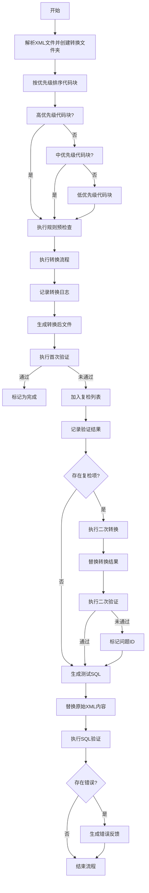

# 数据库迁移实施方案

## 方案概述
本方案采用分阶段渐进式迁移策略，通过双重验证机制确保转换可靠性，主要包含7个核心阶段：
1. 预处理与优先级排序
2. 规则驱动转换
3. 验证反馈机制
4. 迭代优化
5. 最终验证
6. SQL测试生成
7. 结果回写与验证




## 详细实施步骤

### 1. 预处理阶段

```markdown
- **输入**：原始XML文件夹
- **处理流程**：
  1. 创建转换工作区
  2. XML解析与代码块提取
  3. 基于行数的优先级标记：
     - 高优先级：<40行（绿色通道）
     - 中优先级：40-80行（黄色通道）
     - 低优先级：>80行（红色通道）
- **输出**：
  - 代码块存储文件（含ID标记）
  - 优先级清单
```

### 2. 规则转换阶段
```markdown
- **输入**：优先级清单 + 规则文件
- **处理流程**：
  1. 规则预校验（语法/逻辑检查）
  2. 分优先级顺序执行转换
  3. 生成转换日志：
    - 成功转换记录
    - 规则冲突预警
    - 异常捕获日志
- **输出**：
  - 转换后文件
  - 转换日志（transformation.log）
```

### 3. 首次验证阶段
```markdown
- **验证机制**：
  - 结构完整性检查
  - 标签闭合验证
  - 变量替换检查
- **异常处理**：
  - 创建复检列表（retest_list.csv）
  - 生成详细错误报告（error_report_v1.md）
```

### 4. 二次转换阶段
```markdown
- **输入**：复检列表 + 首次转换结果
- **优化策略**：
  1. 问题定位分析
  2. 规则权重调整
  3. 直接覆盖式转换
- **特殊处理**：
  - 保留原始转换日志
  - 追加二次转换记录
```

### 5. 最终验证阶段
```markdown
- **验证重点**：
  - 残留未转换标签
  - 变量注入正确性
  - SQL可执行性预检
- **输出**：
  - 最终问题ID清单（final_issue_ids.txt）
  - 验证摘要报告（validation_summary.pdf）
```

### 6. SQL测试生成
```markdown
- **生成规则**：
  1. XML标签清理
  2. 动态变量替换
  3. 语句格式化
- **输出**：
  - 可执行SQL脚本（*.sql）
  - 脚本映射表（script_mapping.csv）
```

### 7. 结果回写与验证
```markdown
- **回写策略**：
  1. 版本控制（Git）
  2. 差异比对（diff工具）
  3. 回滚机制
- **SQL验证**：
  - 执行错误捕获
  - 性能基线测试
  - 结果集比对
```

## 注意事项
```markdown
1. **流程图说明**：
   - 🔴红色路径：异常处理流程
   - 🟢绿色路径：正常通过流程
   - 🟡黄色节点：需人工介入环节
   - ⬥菱形节点：系统自动判断

2. **风险控制**：
   - 保留原始文件备份（original_backup/）
   - 设置每日转换上限（防止资源耗尽）
   - 实施转换结果抽样检查

3. **性能优化**：
   - 采用分块并行处理
   - 使用内存缓存机制
   - 实现断点续转功能
```
