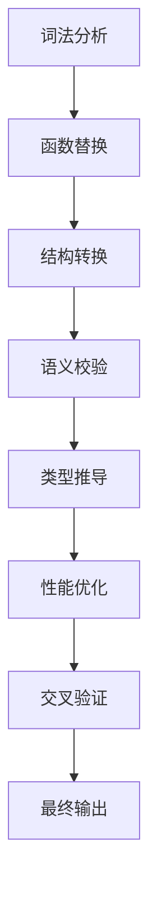

# MySQL 到 PostgreSQL 转换规则

## 函数替换规则

#### 结构说明

- **键名**: MySQL 函数名
- **属性**:
  - `replace_with`: PostgreSQL 替换表达式（使用 mustache 模板语法）
  - `context`: 使用场景描述
  - `syntax_change`: 参数结构变化
  - `examples`: 转换前后的示例

### UUID 相关函数

- **函数**: `UUID()`
  - **替换为**: `uuid_generate_v4() || ''`
  - **上下文**: 用于生成唯一标识符
  - **示例**:
    - **转换前**: `MD5(UUID())`
    - **转换后**: `MD5(uuid_generate_v4() || '')`
    - **说明**: PostgreSQL 需要显式类型转换
  - **注意**: UUID() 函数需要显式类型转换

### IFNULL 函数

- **函数**: `IFNULL`
  - **替换为**: `COALESCE`
  - **示例**:
    - **转换前**: `IFNULL(column, default_value)`
    - **转换后**: `COALESCE(column, default_value)`

### GROUP_CONCAT 函数

- **函数**: `GROUP_CONCAT`
  - **替换为**: `string_agg`
  - **语法变化**:
    - **转换前**: `GROUP_CONCAT(column)`
    - **转换后**: `string_agg(column, ',')`
  - **示例**:
    - **转换前**: `GROUP_CONCAT(DISTINCT column)`
    - **转换后**: `string_agg(DISTINCT column, ',')`
    - **转换前**: `GROUP_CONCAT(column ORDER BY other_col)`
    - **转换后**: `string_agg(column, ',' ORDER BY other_col)`
    - **转换前**: `GROUP_CONCAT(col1 SEPARATOR ';')`
    - **转换后**: `string_agg(col1, ';')`
  - **参数转换**: `({{args}})' => '({{args}}, ',')`
  - **注意事项**:
    - 必须统一使用 string_agg
    - 确保参数结构变化正确，如增加分隔符参数

### 日期时间函数

- **DATE_FORMAT**

  - **替换为**: `to_char`
  - **格式映射**:
    - `%Y-%m-%d %T` → `YYYY-MM-DD HH24:MI:SS`
    - `%Y-%m-%d` → `YYYY-MM-DD`
    - `%T` → `HH24:MI:SS`
    - `%Y` → `YYYY`
    - `%m` → `MM`
    - `%d` → `DD`
    - `%H` → `HH24`
    - `%i` → `MI`
    - `%s` → `SS`
  - **示例**:
    - **转换前**: `DATE_FORMAT(column, '%Y-%m-%d %T')`
    - **转换后**: `to_char(column, 'YYYY-MM-DD HH24:MI:SS')`
    - **转换前**: `assign_time &lt; CONCAT(DATE_FORMAT(assign_time, '%Y-%m-%d'))`
    - **转换后**: `assign_time &lt; to_timestamp(to_char(assign_time, 'YYYY-MM-DD') || ' 08:00:00', 'YYYY-MM-DD HH24:MI:SS')`
  - **注意**:
    - 格式说明符映射规则
    - 需要注意时区处理差异
    - 当用于时间比较时，需要将to_char结果拼接具体时间后转换为timestamp

- **STR_TO_DATE**

  - **替换为**: `to_timestamp`
  - **示例**:
    - **转换前**: `STR_TO_DATE(#{param}, '%Y-%m-%d %T')`
    - **转换后**: `to_timestamp(#{param}, 'YYYY-MM-DD HH24:MI:SS')`

- **DATE_ADD**

  - **替换为**: `date_add`
  - **语法变化**:
    - **转换前**: `DATE_ADD(date, INTERVAL value unit)`
    - **转换后**: `date_add('unit', value, date)`
    - **注意**:
    - 函数名不区分大小写，只转换参数

- **FROM_UNIXTIME**
  - **替换为**: `to_timestamp`
  - **格式映射**:
    - `%Y-%m-%d %T` → `YYYY-MM-DD HH24:MI:SS`
    - `%Y-%m-%d` → `YYYY-MM-DD`
    - `%T` → `HH24:MI:SS`
    - `%Y` → `YYYY`
    - `%m` → `MM`
    - `%d` → `DD`
    - `%H` → `HH24`
    - `%i` → `MI`
    - `%s` → `SS`
  - **示例**:
    - **转换前**: `FROM_UNIXTIME(column/1000,'%Y-%m-%d')`
    - **转换后**: `to_timestamp(column/1000)::date` 或 `to_timestamp(column/1000, 'YYYY-MM-DD')`
    - **转换前**: `FROM_UNIXTIME(ts/1000,'%Y-%m-%d %T')`
    - **转换后**: `to_timestamp(ts/1000, 'YYYY-MM-DD HH24:MI:SS')`
  - **注意事项**:
    1. 必须保留格式参数并进行映射转换
    2. 输入为毫秒时间戳时需要先除以1000
    3. 当需要日期部分时建议使用::date类型转换
    4. 时区处理需保持与MySQL一致

- **unix_timestamp**

  - **替换为**: `EXTRACT`
  - **示例**:
    - **转换前**: `unix_timestamp(DATE_SUB(now(),INTERVAL 30 DAY))*1000)`
    - **转换后**: `EXTRACT(EPOCH FROM DATE_ADD('day', -30, now()))*1000)`
    - **转换前**: `unix_timestamp(DATE_SUB(now(),INTERVAL 24 HOUR))*1000)`
    - **转换后**: `EXTRACT(EPOCH FROM DATE_ADD('hour', -24, now()))*1000)`


- **TIMESTAMPDIFF**
  - **替换模式**:
    ```mustache
    TIMESTAMPDIFF({{unit}}, {{start_time}}, {{end_time}}) 
    → 
    floor(extract(epoch from ({{end_time}} - {{start_time}})) / {{divisor}})
    ```
  - **单位映射**:
    - `MINUTE`: divisor=60
    - `HOUR`: divisor=3600
    - `DAY`: divisor=86400
  - **示例**:
    - **转换前**: 
      ```sql
      TIMESTAMPDIFF(HOUR, MIN(w.assign_time), NOW())
      ```
    - **转换后**: 
      ```sql
      floor(extract(epoch from (NOW() - MIN(w.assign_time))) / 3600)
      ```
    - **转换前**: 
      ```sql
      TIMESTAMPDIFF(DAY, last_time, now())
      ```
    - **转换后**: 
      ```sql
      floor(extract(epoch from (now() - last_time)) / 86400)
      ```


  - **示例**:
    - **转换前**: `TIMESTAMPDIFF(DAY,last_time,now()) &gt;= (select param_value from s_param_value where param_id = 'alert_interval_time' AND status = 1)`
    - **转换后**: `and (floor(extract(day from (now()-last_time)))) &gt;= (select cast(param_value as int) from s_param_value where param_id = 'alert_interval_time' AND status = '1')`

- **DATE_SUB**

  - **替换为**: `date_add('type',-'{{interval}}',{{arg1}})`
  - **注意**: INTERVAL 表达式必须使用单引号
  - **示例**:
    - **转换前**: `DATE_SUB(curdate(), INTERVAL 30 DAY)`
    - **转换后**: `date_add('day',-30,CURRENT_DATE)`
    - **转换前**: `DATE_SUB(#{param}, INTERVAL 3 MONTH)`
    - **转换后**: `date_add('month',-3,#{param})`
    - **转换前**: `DATE_SUB(#{param1}, INTERVAL #{param2} day)`
    - **转换后**: `date_add('day',-#{param2},#{param1})`

### 增强的IF函数转换规则

1. **基础转换模式**：
   - **模式匹配**：`IF\(([^,]+),\s*([^,]+),\s*([^)]+)\)`
   - **替换为**：`(CASE WHEN $1 THEN $2 ELSE $3 END)`
   - **示例**：
     ```sql
     IF(a > b, 'Y', 'N') → (CASE WHEN a > b THEN 'Y' ELSE 'N' END)
     ```

2. **嵌套函数处理**：
   - **模式匹配**：`([A-Za-z_]+)\(.*IF\(.*?\).*?\)`
   - **处理方式**：从最内层IF开始转换
   - **示例**：
     ```sql
     CONCAT(IF(a=1,'A',''), IF(b=2,'B','')) 
     → 
     CONCAT(
       (CASE WHEN a=1 THEN 'A' ELSE '' END),
       (CASE WHEN b=2 THEN 'B' ELSE '' END)
     )
     ```

3. **多参数IF处理**：
   - **模式匹配**：`IF\(([^,]+),\s*('[^']+'|\d+),\s*('[^']+'|\d+)\)`
   - **处理方式**：保持参数原样转换
   - **示例**：
     ```sql
     IF(status=1, 'active', 0) 
     → 
     (CASE WHEN status=1 THEN 'active' ELSE 0 END)
     ```

4. **UPDATE语句中的IF转换**：
   - **说明**: 在UPDATE语句中,IF函数通常用于条件更新字段值。转换时需要注意:
     1. 移除末尾多余的逗号
     2. 保持ELSE子句与原字段值一致
     3. 确保条件表达式使用字符串类型比较
   - **示例**：
     ```sql
     i.is_reappear = if((i.is_epicycle_end = '1'),'1',i.is_reappear),
     → 
     i.is_reappear = case when (i.is_epicycle_end = '1') then '1' else i.is_reappear end
     ```
### 字符串函数

- **LOCATE**
  - **替换为**: `POSITION({{arg1}} IN {{arg2}})`
  - **示例**:
    - **转换前**: `LOCATE(#{cdstip}, m.ips) > 0`
    - **转换后**: `POSITION(#{cdstip} IN m.ips) > 0`

## 特定 SQL 语句结构的转换处理
### 多表更新转换

#### 检测规则
- **检测模式**: `UPDATE table1, table2 SET` 结构
- **转换原则**:
  1. 将多表更新拆分为独立 UPDATE 语句
  2. 为每个表的更新构建子查询，确保子查询包含原更新中的连接条件和过滤条件
  3. 将拆分后的更新语句与子查询结合，形成独立的 UPDATE 语句
  4. 确保子查询正确引用了各个表的条件，检查逻辑是否正确，以确保更新操作符合预期

#### 示例
##### 通用示例
- **转换前**:
```sql
  UPDATE table1 t1, table2 t2, ..., tablen tn 
SET 
    t1.column1 = 'value1',
    t2.column2 = 'value2',
    ...,
    tablen.columnn = 'valuen'
WHERE 
    t1.id = t2.id 
    AND t2.id = t3.id 
    AND ... 
    AND t1.status = 'active' 
    AND t2.status = 'active' 
    AND ...;
```  
- **转换后**:
```sql
UPDATE table1 t1
SET t1.column1 = 'value1'
WHERE 
    t1.status = 'active' 
    AND t1.id IN (
        SELECT t2.id 
        FROM table2 t2 
        WHERE 
            t2.status = 'active' 
            AND t2.id IN (
                SELECT t3.id 
                FROM table3 t3 
                WHERE 
                    t3.status = 'active' 
                    AND ...
            )
        )
    );
UPDATE table2 t2
SET t2.column2 = 'value2'
WHERE 
    t2.status = 'active' 
    AND t2.id IN (
        SELECT t1.id 
        FROM table1 t1 
        WHERE 
            t1.status = 'active' 
            AND t1.id IN (
                SELECT t3.id 
                FROM table3 t3 
                WHERE 
                    t3.status = 'active' 
                    AND ...
            )
        )
    );
```
##### 实际示例
- **转换前**:
```sql
UPDATE assets_business bus
LEFT JOIN (
    SELECT d1.assets_business_id, COUNT(DISTINCT dl.id) count 
    FROM assets_business_domain d1 
    WHERE d1.assets_business_id = (
        SELECT d2.assets_business_id 
        FROM assets_business_domain d2 
        WHERE d2.id = 's' 
        AND d2.status = '1'
    ) 
    AND d1.status = '1'
    GROUP BY d1.assets_business_id
) abd 
ON abd.assets_business_id = bus.id 
SET bus.status = '0' 
WHERE abd.count = 1;

```
- **转换后**:
```sql
UPDATE assets_business 
SET status = '0' 
WHERE id IN (
    SELECT assets_business_id 
    FROM assets_business_domain 
    WHERE assets_business_id IN (
        SELECT d2.assets_business_id 
        FROM assets_business_domain d2 
        WHERE d2.id = 's' 
        AND d2.status = '1'
    ) 
    AND status = '1'
    GROUP BY assets_business_id 
    HAVING COUNT(DISTINCT id) = 1
);

```
#### 子查询having的特殊处理


##### 规则
- 避免直接使用复杂的 HAVING 条件
- 将复杂的 HAVING 条件移到 WHERE 子句
- 确保子查询正确包层

##### 示例
- **转换前**:
```sql
SELECT ... 
FROM (
    SELECT ... 
    FROM ... 
    HAVING condition
) sub
```
- **转换后**:
```sql
SELECT ... 
FROM (
    SELECT * 
    FROM (
        SELECT ... 
        FROM ... 
        WHERE condition
    ) sub1
) sub
```
#### 注意事项
1. **条件一致性**：确保子查询包含原 WHERE 条件的所有要素
2. **性能优化**：对涉及大数据量的更新建议添加索引
3. **事务处理**：多个 UPDATE 语句应包裹在事务中
4. **空值处理**：使用 EXISTS 代替 IN 避免 NULL 值问题
5. **别名保留**：保持原查询中的表别名命名规则  

### REPLACE INTO

- **检测**: `REPLACE INTO`
- **转换方式**:
  - `DELETE FROM + INSERT INTO`
  - `INSERT ON CONFLICT`
- **示例**:
  - **转换前**: `REPLACE INTO table (col) VALUES (val)`
  - **转换后**:
    ```sql
    DELETE FROM table WHERE col=val;
    INSERT INTO table (col) VALUES (val);
    ```


### INSERT 冲突处理

- **ON DUPLICATE KEY UPDATE**:
  - **替换为**: `ON CONFLICT (key) DO UPDATE SET`
  - **示例**:
    - **转换前**: `INSERT INTO table (...) VALUES (...) ON DUPLICATE KEY UPDATE col=val`
    - **转换后**: `INSERT INTO table (...) VALUES (...) ON CONFLICT (id) DO UPDATE SET col=val`

## 值转换

### 值转换规则中的状态值转换

**规则描述**：
- 将数值类型的 status 转换为字符串类型，只转换确定的status字段,其他的字段不转换
- **示例**：
  - `status = 1  type = 2 `→ `status = '1'  type = 2` ，注意只转换了status从1到'1'，tyep的1并没有变
  - `SELECT 1 status` → `SELECT '1' as status`
  - `status <![CDATA[<>]]> 8` → `status <![CDATA[<>]]> '8'`


**适用场景**：
- 所有与状态值相关的字段比较
- 只限于status字段
- 适用于 WHERE 条件、SELECT 列表、JOIN 条件等所有出现数值状态的地方

### 类型转换

- **SIGNED**:
  - **替换为**: `INTEGER`
  - **示例**:
    - **转换前**: `CAST(value as SIGNED)`
    - **转换后**: `CAST(value as INTEGER)`
#### 显式类型转换
- **规则**: 除非特别说明，不要添加或修改任何显式类型转换（如 `::text`、`::integer` 等）
- **示例**:
  - **保持原样**:
    ```sql
    string_agg(id, ',')
    ```
  - **不要自行添加类型转换**:
    ```sql
    string_agg(id::text, ',')  -- 错误：不要添加 ::text
    ```

#### 类型转换白名单
- 只对现有规则进行转换

#### 原则
- 默认保持原有的类型处理方式
- 只在规则明确指定时才进行类型转换
- 如遇到类型不兼容问题，应先请求规则更新而不是自行添加转换


### GROUP BY

#### 规则说明

**核心原则**:
1. 必须显式列出SELECT列表中的所有非聚合列到GROUP BY
2. 当使用GROUP BY时自动移除DISTINCT关键字
3. 保持SELECT列表与GROUP BY列完全一致
4. 自动补全缺失的非聚合列（基于简单模式匹配）

**处理策略**:
1. **列识别模式**:
   - 使用正则匹配识别`SELECT`后的非聚合列（排除COUNT/SUM/AVG等开头的表达式）
   - 示例模式：`SELECT\s+((?!COUNT|SUM|AVG|MAX|MIN)[a-z0-9_]+)(,|FROM)`

2. **DISTINCT处理**:
   - 当检测到`SELECT DISTINCT`与`GROUP BY`共存时：
     1. 移除DISTINCT关键字
     2. 记录警告信息

3. **自动补全机制**:
   - 步骤：
     1. 提取SELECT后第一个FROM前的所有列
     2. 过滤掉聚合函数表达式（如COUNT(x)）
     3. 对比现有GROUP BY列
     4. 添加缺失列（保持原始顺序）

4. **多表处理**:
   - 对带表别名的列（如t1.col）保持原始格式
   - 示例处理：
     ```sql
     SELECT t1.a, t2.b → GROUP BY t1.a, t2.b
     ```

**示例集合**:
```sql
/* 基础补全（保持原始顺序） */
转换前:
SELECT a, b, c, COUNT(*)
FROM table
GROUP BY a

转换后:
SELECT a, b, c, COUNT(*)
FROM table
GROUP BY a, b, c

/* 含表别名的处理 */
转换前:
SELECT t1.id, t2.name, MAX(score)
FROM table1 t1
JOIN table2 t2 ON t1.id = t2.id
GROUP BY t1.id

转换后:
SELECT t1.id, t2.name, MAX(score)
FROM table1 t1
JOIN table2 t2 ON t1.id = t2.id
GROUP BY t1.id, t2.name

/* 子查询处理 */
转换前:
SELECT sq.year, AVG(sq.sales)
FROM (
  SELECT DATE_FORMAT(date_col, '%Y') year, sales
  FROM orders
) sq
GROUP BY sq.year

转换后:
SELECT sq.year, AVG(sq.sales)
FROM (
  SELECT to_char(date_col, 'YYYY') as year, sales
  FROM orders
) sq
GROUP BY sq.year
```

**注意事项**:
1. 仅处理显式写出的列名，不解析星号(*)展开
2. 对复杂表达式（如CASE WHEN）保持原样并提示人工检查
3. 当存在列别名时，GROUP BY使用原始列名
   - 示例：`SELECT col as c → GROUP BY col`
4. 对嵌套查询需要逐层处理GROUP BY
   - 示例：
     ```sql
     /* 转换前 */
     SELECT a, MAX(b) 
     FROM (
       SELECT x a, y b 
       FROM t 
       GROUP BY x  -- 需要处理内层GROUP BY
     ) sub
     
     /* 转换后 */
     SELECT a, MAX(b)
     FROM (
       SELECT x a, y b 
       FROM t 
       GROUP BY x, y  -- 补全内层缺失列
     ) sub 
     GROUP BY a  -- 补全外层缺失列
     ```


## 查询结构

### having

- **规则**: 
  - 禁止在 HAVING 子句中使用列别名
  - 必须使用原始聚合表达式
  - 或使用子查询包装后在外层 WHERE 过滤
- **新增示例**:
  - **转换前**: 
    ```sql
    SELECT level_id, COUNT(1) AS num 
    FROM event_template 
    GROUP BY level_id 
    HAVING num > 30
    ```
  - **转换后**: 
    ```sql
    SELECT * FROM (
        SELECT level_id, COUNT(1) AS num 
        FROM event_template 
        GROUP BY level_id
    ) a 
    WHERE num > 30
    ```
- **注意事项**:
  1. 当 HAVING 子句中使用的是 SELECT 列表中的别名时，必须改为使用聚合表达式或改为子查询过滤
  2. 优先推荐使用子查询包装方式
  3. 保持聚合条件在原始查询中，过滤条件在外层查询

## 标识符规则

### 反引号

- **操作**: 移除``
  - **转换前**:
    ```sql
    `column_name`
    ```
- **转换后**:
  ```sql
  column_name
  ```
- **说明**: PostgreSQL 将``都移除

## 别名添加as 尤其是location 

- **规则**: 为别名添加显式 AS ，尤其是location 其他别名也统一添加
- **示例**:
  - **转换前**: `SELECT col location from ...`
  - **转换后**: `SELECT col AS location from ...`
  - **转换前**: `SELECT '1' status`
  - **转换后**: `SELECT '1' AS status`

## 别名处理规则

### 1. 作用域保留原则
**规则编号**：ALIAS-001
```sql
/* 原始MySQL */
SELECT assign_time FROM table

/* 正确PG转换 */
SELECT assign_time FROM table  -- 保持原始字段名

/* 错误示例 */
SELECT au.assign_time FROM table -- 禁止添加不存在的作用域别名
```

### 2. 子查询字段引用
**规则编号**：ALIAS-002
```sql
/* 原始MySQL */
SELECT t1.time FROM (
  SELECT assign_time AS time FROM table
) t1

/* 正确PG转换 */
SELECT t1.time FROM (
  SELECT assign_time AS time FROM table
) t1  -- 保持子查询别名

/* 禁止行为 */
SELECT au.t1.time FROM (...) au  -- 不得添加额外别名层级
```

### 3. 复合表达式处理
**规则编号**：ALIAS-004
```sql
/* 原始MySQL */
CONCAT(DATE_FORMAT(assign_time, '%Y-%m-%d'), #{workEndTime})

/* 正确PG转换 */
to_char(assign_time, 'YYYY-MM-DD') || #{workEndTime}  -- 保持原始字段引用

/* 错误示例 */
to_char(au.assign_time, 'YYYY-MM-DD') || #{workEndTime} -- 禁止添加别名
```


### BETWEEN 参数修改

- **替换**:参数类型转换, 修改and标识的字符串类型的参数
- **规则**: BETWEEN AND ，如果参数类型是字符串，转换为 in ，日期和数字不需要转
- **示例**:
  - **转换前**: `BETWEEN '1' and '3'`
  - **转换后**: `in ('1','2','3')`
  - **转换前**: `BETWEEN 1 and 3`
  - **转换后**: `BETWEEN 1 and 3`

### /COUNT(DISTINCT) 防止除0异常
- **替换**: 防止除0异常
- **示例**:
  - **转换前**: `SELECT COUNT(1)/COUNT(DISTINCT u.user_id)`
  - **转换后**: `SELECT COUNT(1)/case when COUNT(DISTINCT u.user_id)=0 then null else COUNT(DISTINCT u.user_id) end `


### 复杂查询转换策略

- **描述**: 从内层函数/表达式开始向外转换
- **步骤**:
  1. 解析原始 SQL 嵌套结构
  2. 识别最内层函数调用
  3. 应用基本函数转换规则
  4. 处理中间结果数据类型
  5. 逐层处理外层表达式
  6. 最后处理整体查询结构
- **示例**:
  - **原始查询**: `SELECT MD5(UUID()) FROM (SELECT IFNULL(col,1) FROM table)`
  - **处理顺序**:
    1. 将内层 IFNULL 转换为 COALESCE
    2. 在子查询中处理 UUID() 到 uuid_generate_v4()
    3. 转换外层 MD5 函数中的类型转换
    4. 组合最终结果


### 转义符保留规则

- **规则描述**：保留所有 XML/HTML 转义符，禁止转换为符号
- **转换模式**：
  - `&lt;` → 保持原样
  - `&gt;` → 保持原样
  - `&amp;` → 保持原样
- **示例**：
  - **转换前**：`col &lt; 10 AND col &gt; 5`
  - **转换后**：`col &lt; 10 AND col &gt; 5`
  - **转换前**：`name &lt;&gt; 'test'`
  - **转换后**：`name &lt;&gt; 'test'`
- **注意事项**：
  1. 仅处理转义符本身，不影响实际比较逻辑
  2. 适用于所有 SQL 语句中的转义符
  3. 需要同时处理 CDATA 块内外的转义符
  4. 保留转义符的大小写形式（如`&LT;`也需保留）


## 质量保障体系

### 分层转换机制
采用七层处理流程确保规则全覆盖：


### 规则优先级矩阵
| 规则类型       | 处理阶段      | 检测方法                  | 容错机制              |
|----------------|-------------|-------------------------|---------------------|
| 函数替换       | 词法分析阶段  | 正则模式匹配              | 未匹配项日志告警      |
| 结构转换       | 语法分析阶段  | AST 解析                | 结构差异度评分        |
| 类型系统       | 语义分析阶段  | 数据类型推导             | 隐式转换建议         |
| 性能相关       | 优化阶段      | 执行计划分析             | 索引建议生成         |

### 多阶段验证流程
1. **基础转换阶段**
   - 函数/表达式替换
   - 关键字转换

2. **结构验证阶段**
   ```python
   # 伪代码示例
   def validate_group_by(ast):
       select_cols = get_non_agg_columns(ast.select)
       group_cols = ast.group_by.columns
       missing = select_cols - group_cols
       if missing:
           raise ValidationError(f"缺少GROUP BY列: {missing}")
   ```

3. **语义检查阶段**
   - 类型兼容性验证
   - 别名作用域检查
   - 隐式转换检测

### 测试用例规范
| 测试类型       | 用例示例                              | 验证点                  |
|---------------|-------------------------------------|-----------------------|
| 正向测试       | `SELECT GROUP_CONCAT(id)` → `string_agg` | 函数替换正确性          |
| 负向测试       | 缺少GROUP BY列查询                   | 触发自动修正机制        |
| 边缘案例       | `GROUP BY 1`                        | 列位置到列名的转换        |

### 实时监控指标
```text
转换质量看板应包含：
- 已应用规则数/总规则数
- 警告分类统计
- 置信度评分（0-100）
- 未处理模式TOP10
```


## 实施要求
1. 所有转换必须通过完整7层处理流程


## 重点注意事项
### 遵循以下原则：
- 只修改明确提供的代码内容，不关注文件其他上下文
- 规则检查不区分大小写，比如`BETWEEN`和`between`是一样的
- 确保每条规则都检查一遍是否需要转换
- 遵循最小改动原则
- 严格按照规则
- 确保没有遗漏的转换
- 不需要检查以上规则未提到的PostgreSQL语法

## 重点注意事项
### 不要做出除了以上规则之外的任何改动，不要做的改动举例：
- 使代码更简洁
- 统一使用空格进行缩进，替换原有的制表符
- 代码缩进和格式基本修改
- 修改规则之前的bug修改
- 验证代码内容完整且有效做的优化


## 注意事项
1. **保留原有结构**：
   - 不优化缩进/换行
   - 保持原有代码格式


